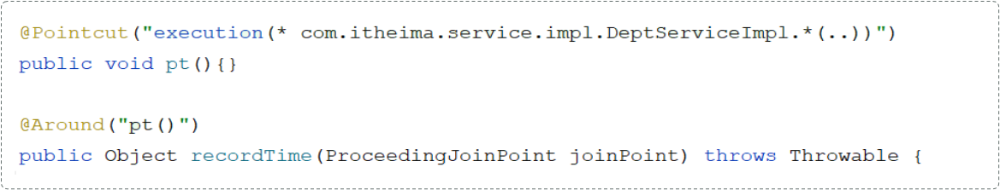

# 1、什么是AOP

---

AOP**：**Aspect Oriented Programming（面向切面编程、面向方面编程），可简单理解为就是面向特定方法编程。

基于动态代理技术实现的。

场景：案例中部分业务方法运行较慢，定位执行耗时较长的方法，此时需要统计每一个业务方法的执行耗时。

优点

1. 减少重复代码
2. 代码无侵入
3. 提高开发效率
4. 维护方便

## 1.1 核心概念

- **连接点：**JoinPoint，可以被AOP控制的方法（暗含方法执行时的相关信息）
- **通知：**Advice，指那些重复的逻辑，也就是共性功能（最终体现为一个方法）
- **切入点：**PointCut，匹配连接点的条件，通知仅会在切入点方法执行时被应用（实际被AOP控制的方法）
- **切面：**Aspect，描述通知与切入点的对应关系（通知+切入点）
- **目标对象：**Target，通知所应用的对象

切入点一定是连接点，但连接点不一定是切入点。

## 1.2 通知

1. @Around：环绕通知，此注解标注的通知方法在目标方法前、后都被执行
2. @Before：前置通知，此注解标注的通知方法在目标方法前被执行
3. @After ：后置通知，此注解标注的通知方法在目标方法后被执行，无论是否有异常都会执行
4. @AfterReturning： 返回后通知，此注解标注的通知方法在目标方法后被执行，有异常不会执行
5. @AfterThrowing ： 异常后通知，此注解标注的通知方法发生异常后执行

### 1.2.1 @PointCut

该注解的作用是将公共的切点表达式抽取出来，需要用到时引用该切点表达式即可。



### 1.2.2 通知顺序

不同切面类中，默认按照切面类的类名字母排序：

- 目标方法前的通知方法：字母排名靠前的先执行
- 目标方法后的通知方法：字母排名靠前的后执行

用 @Order(数字) 加在切面类上来控制顺序

- 目标方法前的通知方法：数字小的先执行
- 目标方法后的通知方法：数字小的后执行

## 1.3 切入点表达式


其中带 ? 的表示可以省略的部分

1. 访问修饰符：可省略（比如: public、protected）
2. 包名.类名： 可省略(但不建议这么做)
3. throws 异常：可省略（注意是方法上声明抛出的异常，不是实际抛出的异常）

*：单个独立的任意符号，可以通配任意返回值、包名、类名、方法名、任意类型的一个参数，也可以通配包、类、方法名的一部分

```java
execution(* com.*.service.*.update*(*))
```

... ：多个连续的任意符号，可以通配任意层级的包，或任意类型、任意个数的参数

```java
execution(* com.itheima..DeptService.*(..))
```

书写建议

- 所有业务方法名在命名时尽量规范，方便切入点表达式快速匹配。如：findXxx，updateXxx。
- 描述切入点方法通常基于接口描述，而不是直接描述实现类，增强拓展性。
- 在满足业务需要的前提下，尽量缩小切入点的匹配范围。如：包名尽量不使用..，使用*匹配单个包。

### 1.3.1 @annotation

@annotation 切入点表达式，用于匹配标识有特定注解的方法。

```java
@Target(ElementType.METHOD)
@Retention(java.lang.annotation.RetentionPolicy.RUNTIME)
public @interface LogOperation {
}


//AOP中引入注解，当在需要的方法上加入@LogOperatio，即可实现匹配切入点
@Around("@annotation(com.itheima.anno.LogOperation)") 
```

